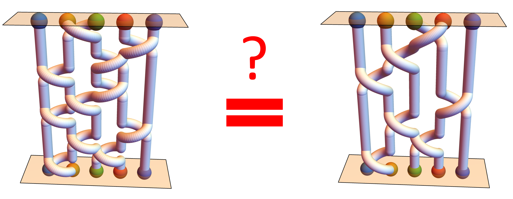

# 	Unsupervised Learning of Topological Non-Abelian Braiding in Non-Hermitian Bands
[](https://arxiv.org/abs/2401.17968)
[](https://opensource.org/licenses/MIT)

This repository, [`ml_topology_non_Abelian_braiding`](https://github.com/longyangking/ml_topology_non_Abelian_braiding), contains
reproducible code for our manuscript,
[`Unsupervised Learning of Topological Non-Abelian Braiding in Non-Hermitian Bands`](https://arxiv.org/abs/2401.17968).

The code in this repository include: 
+ Generate non-Hermitian braided multiple bands according to the braid word
+ Represent any complex-energy bandstructure into a braid diagram
+ Unsupervised classification of two topologically different braids formed by complex-energy bands
+ Generate the one-dimensional non-Hermitian Hamiltonian with the customed braided bands (also calcuate the the energy spectrum and eigenstate under the periodic/open boundary condition)
+ Calculate the winding matrix
+ Address the unknotting problem in an unsupervised manner

The functions of the modules:
+ ``braiding_model`` containts the functions that generate the complex-energy bands and construct the non-Hermitian lattice Hamiltonian according to the braid words. 
+ ``machine_learning`` contains the unsupervised learning algorithm proposed in Ref.[1]. 
+ ``topology`` containts the similarity function and some related functions. 
+ ``figs`` contains the code that generate the figures in the paper. Note that some figures (e.g., 3D view of braids) in the paper are re-plotted by [Wolframe Mathematica](https://www.wolfram.com/mathematica/).

## Required packages
+ Numpy >= 1.26
+ Matplotlib >= 3.8
+ Numba >= 0.5
+ Jupyter Notebook 

It is recommended to use the latest [Anaconda](https://www.anaconda.com/download). For runing all the code in this repository, there is no need to install the above packages if you use Anaconda (NOT Miniconda). 

All the code are tested on Ubuntu 18.04. 

## License
MIT license


## Examples and demos

One can open the ipynb files in the directory ``figs`` to view details and re-obtain results. 


## E-mail
If you have any question about the code in this repository, please feel free to contact us.

+ yang.long.physics@outlook.com
+ yang.long@ntu.edu.sg
+ blzhang@ntu.edu.sg
+ longyang_123@yeah.net (not often use)

## How to cite

```
@misc{long2024unsupervised,
      title={Unsupervised Learning of Topological Non-Abelian Braiding in Non-Hermitian Bands}, 
      author={Yang Long and Haoran Xue and Baile Zhang},
      year={2024},
      eprint={2401.17968},
      archivePrefix={arXiv},
      primaryClass={cond-mat.mes-hall}
}
```

## References
1. Yang Long and Baile Zhang. "Unsupervised Data-Driven Classification of Topological Gapped Systems with Symmetries", [Phys. Rev. Lett. 130, 036601](https://doi.org/10.1103/PhysRevLett.130.036601) 