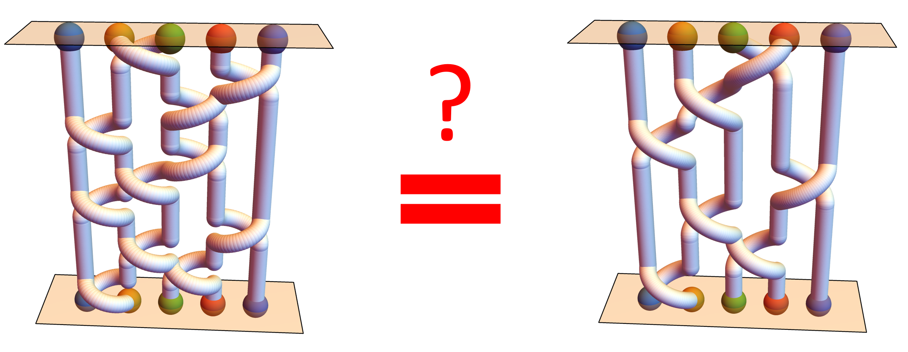

# 	Unsupervised Learning of Topological Non-Abelian Braiding in Non-Hermitian Bands

This repository, [`ml_topology_non_Abelian_braiding`](https://github.com/longyangking/ml_topology_non_Abelian_braiding), contains
reproducible code for our manuscript,
[`Unsupervised Learning of Topological Non-Abelian Braiding in Non-Hermitian Bands`](https://arxiv.org/abs/2401.17968).

## Required packages
Numpy, Matplotlib